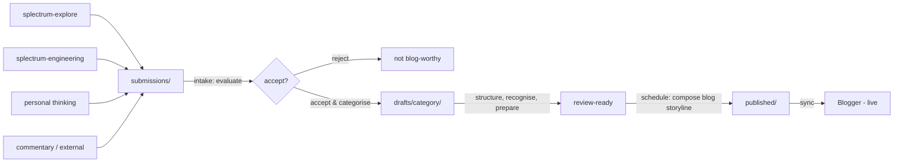

# The Blog as Public Conscious Persona

## Storyline

### What this post says

The blog is a public conscious persona. Three words, each doing work:

**Persona** — a communication channel, a language game with its own vocabulary, rules, participants. The blog as a form of life. Not a collection of posts but a voice in an ongoing conversation with readers. The persona owns that conversation — what to say, when to say it, how it sits alongside everything else.

**Conscious** — we are many things at the same time. Engineering, research, philosophy, personal thinking — each lives in its own space, at its own pace. Not everything surfaces. The blog is what's brought forward into conscious focus — selected, shaped, shared. Like consciousness itself: information made visible. The blog doesn't control what arrives. Material is surfaced from other work. But from the moment it's visible, the blog has full autonomy over what to do with it.

**Public** — personal becomes shared. The conscious mind's work — structuring, recognising, preparing — is private. The result is public. The persona speaks. And where it speaks matters — the placement of a post in the blog's ongoing storyline is part of its meaning.

### How we engineer it

**The threshold.** Material is submitted — made visible to the blog. Non-blocking, non-directive. The submitting source doesn't control what happens next. Information crosses the threshold by being shared, not by being pushed or demanded.

**The conscious mind works.** Accepted material gets structured (post storyline), recognised (what category — core, research, thinking, engineering, commentary), and prepared (fit for the reader). These aren't separate stages — they're one integrated process: the mind working on what's been made visible.

**The blog storyline.** Each post has its own internal storyline. But the blog has a storyline too — the sequence, the rhythm, the blend over time. Scheduling is composing this. A post that's ready might wait because the conversation needs something else first. The persona curates the reading experience.

**The collaboration.** Thinking and writing are collaborative — human and AI together. That's the creative core and it stays that way. The management around it — intake, scheduling, pipeline — aims to become autonomous, so all collaborative time is spent on thinking and writing.

### Tone notes

- Engineering post — practical, concrete, shows how it works
- Personal — this is how we work, not a methodology
- The concept (public conscious persona) leads. The engineering serves it.

---

## Raw notes — material that may find its way into the post

**The Python analogy.** The blog is like Python sitting on top of the software stack — it absorbs the complexity of what's below into a language suited for sharing. The reader sees Python, not binary. The reader sees the blog, not the repos underneath.

**Consciousness analogy.** You don't control what enters awareness. Sensory input, thoughts, memories surface. But what you do with them is yours. You attend, ignore, develop, let go. The conscious mind doesn't direct the unconscious — it receives and acts from its own position. The blog works the same way.

**Categories as modes of engagement.** Not topics — modes. Core (Splectrum speaking), Research (observing other vocabularies), Thinking (small bites), Engineering (practical), Commentary (responsive). The same topic can appear in any category. Category is how, topic is what.

**The scheduling algorithm.** Horizon expands with density. 1 post/month → 1 month ahead. 2 posts → 2 months. 4 posts → 4 months. The more productive, the further ahead, the more room to compose. Core posts on 1st and 16th as backbone. Other categories interleave on 8th and 24th. Overflow fills 4th, 12th, 20th, 28th.

**Strategic reserve.** Core posts held back when material is plentiful. Guarantees minimum rhythm (1 core/month) even if other sources dry up. Aim: 6-12 months of core posts available.

**Four roles.** Submission (other repos share), intake (evaluate, accept/reject, categorise), production (think, write, edit — collaborative), scheduling (compose the blog storyline). Current state: all collaborative. Target: submission via Mycelium, intake and scheduling autonomous AI, production stays collaborative.

**The conversation IS the work.** A conversation like the one that produced this structure is itself the engineering. The blog post finds its way to the reader naturally from the thinking.

**Post categories — Splectrum dimension.** Core and engineering are from within Splectrum. Research is looking outward from within. Thinking floats between. Commentary is open/responsive.

**Blog storyline vs post storyline.** Each post has internal coherence. The blog has coherence across posts over time — sequence, rhythm, blend. Scheduling composes the blog storyline. A ready post might wait because the conversation needs something else first.

**Flow diagram (Mermaid — render to image on scheduling):**

**Tooling needed (engineering, done here):**
- `draft-manage.py` (or command group) — draft → scheduled transition. Render Mermaid to image, move files, add date prefix, prepare frontmatter.
- `manage.py` (existing) — Blogger sync. Push content, handle API, manage post IDs.
- Two scripts, two concerns. Draft management is internal. Blogger sync is external.
- Mermaid rendering: code in draft, render to PNG on scheduling, upload to Blogger, replace with `` in published post.
