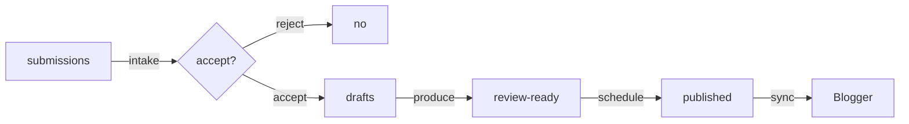
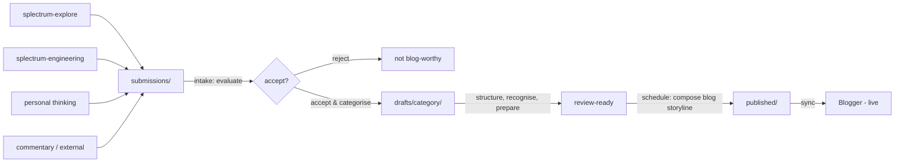

# The Blog as Public Conscious Persona


I finally did it, my blog is up and running with blog posts scheduled weeks ahead. The shared authorship — AI collaborative — is a godsend. So many little tasks are easily taken care of and I can concentrate on the creative part.

The blog wasn't the only accomplishment. Splectrum was born, and made it through the neonatal period: the seed principles have a meaningful place within the evolution of current thinking. Splectrum is now in its infancy. From now on it will develop its own identity. And the blog is part of that. I want the blog to be the public conscious persona of Splectrum. So it is time for a bit of engineering!

At Splectrum we very much believe in ownership at grassroots level, and in this case that means that the blog is and owns the public conscious persona. It is a language game wired into it. So let's do the wiring then.

I like to work in single concern repositories — this keeps both my focus and AI's focus clear. Of course that means there are a number of these repositories — work places — around. They come and go. These are all the activities that are taking place at the Splectrum subconscious level — there is no overall awareness of what is currently active. From time to time bits of information will end up in the conscious part, appearing as out of nowhere. That is the information input into the blog repository.

Within Splectrum engineering I am working on a new repository structure — mycelium — and it is this repository structure that is responsible for referencing those bits of information into the blog repository. In this post it is just assumed that the information pops up within the repo — in the submissions folder. I can't control what gets into my conscious mind, it just happens. And for Splectrum it is engineered the same way.

Great, I now have access to all those conscious bits of information. And more importantly, from hereon in I own them. I can decide to forget about it (flag as rejected) or to use it. I don't want to just throw these conscious thoughts out there — I need to shape them into a conversation held by my public conscious persona. A conversation in public. The pipeline between submission and publishing is the draft stage.

Once a conscious thought is accepted, it is shaped into a draft and saved into the draft stage. The draft stage is a folder structure that pre-organises the thoughts: is it core Splectrum, is it a piece of research or engineering, or just a thought or a comment? A submission gets drafted depending on the type it is — shaping and filtering towards a post storyline, making it ready so the creative writing can be done. This is the part that is really human — AI collaborative.

Once done the post goes through editing and finishing and is ready for scheduling. The raw thoughts have now been shaped into bits of conversation that are ready for public consumption — into words that can be spoken in public. And that is where the last task kicks in: to turn bits of conversation into an engaging continuous storyline. Posts need to be scheduled for publication so they reflect the life that Splectrum as a public persona is living at the moment. Just like the conversations a person would have in public within his or her community.

I don't want to occupy my time with managing this — there is software and autonomous AI to do this for me so I can concentrate in an AI collaborative way on the creative process. Just like my body doing all the autonomous actions while I am consciously busy with my thoughts ...

For the full technical detail of how the persona is wired, see the [Public Conscious Persona 1.0](https://jules-tenbos.github.io/i-wonder/engineering/personas/public-conscious-persona/current) page.

Welcome to Splectrum — Public Conscious Persona 1.0.

---
<small>Photo: <a href="https://unsplash.com/@anniespratt">Annie Spratt</a> / Unsplash</small>

## Notes

---
title: The Blog as Public Conscious Persona
category: engineering
topic: blog management, workflow, AI collaboration
status: scheduled
---

### What this post says

The blog is a public conscious persona. Three words, each doing work:

**Persona** — a communication channel, a language game with its own vocabulary, rules, participants. The blog as a form of life. Not a collection of posts but a voice in an ongoing conversation with readers. The persona owns that conversation — what to say, when to say it, how it sits alongside everything else.

**Conscious** — we are many things at the same time. Engineering, research, philosophy, personal thinking — each lives in its own space, at its own pace. Not everything surfaces. The blog is what's brought forward into conscious focus — selected, shaped, shared. Like consciousness itself: information made visible. The blog doesn't control what arrives. Material is surfaced from other work. But from the moment it's visible, the blog has full autonomy over what to do with it.

**Public** — personal becomes shared. The conscious mind's work — structuring, recognising, preparing — is private. The result is public. The persona speaks. And where it speaks matters — the placement of a post in the blog's ongoing storyline is part of its meaning.

### How we engineer it

**The threshold.** Material is submitted — made visible to the blog. Non-blocking, non-directive. The submitting source doesn't control what happens next. Information crosses the threshold by being shared, not by being pushed or demanded.

**The conscious mind works.** Accepted material gets structured (post storyline), recognised (what category — core, research, thinking, engineering, commentary), and prepared (fit for the reader). These aren't separate stages — they're one integrated process: the mind working on what's been made visible.

**The blog storyline.** Each post has its own internal storyline. But the blog has a storyline too — the sequence, the rhythm, the blend over time. Scheduling is composing this. A post that's ready might wait because the conversation needs something else first. The persona curates the reading experience.

**The collaboration.** Thinking and writing are collaborative — human and AI together. That's the creative core and it stays that way. The management around it — intake, scheduling, pipeline — aims to become autonomous, so all collaborative time is spent on thinking and writing.

### Tone notes

- Engineering post — practical, concrete, shows how it works
- Personal — this is how we work, not a methodology
- The concept (public conscious persona) leads. The engineering serves it.

---

## Raw notes — material that may find its way into the post

**The Python analogy.** The blog is like Python sitting on top of the software stack — it absorbs the complexity of what's below into a language suited for sharing. The reader sees Python, not binary. The reader sees the blog, not the repos underneath.

**Consciousness analogy.** You don't control what enters awareness. Sensory input, thoughts, memories surface. But what you do with them is yours. You attend, ignore, develop, let go. The conscious mind doesn't direct the unconscious — it receives and acts from its own position. The blog works the same way.

**Categories as modes of engagement.** Not topics — modes. Core (Splectrum speaking), Research (observing other vocabularies), Thinking (small bites), Engineering (practical), Commentary (responsive). The same topic can appear in any category. Category is how, topic is what.

**The scheduling algorithm.** Horizon expands with density. 1 post/month → 1 month ahead. 2 posts → 2 months. 4 posts → 4 months. The more productive, the further ahead, the more room to compose. Core posts on 1st and 16th as backbone. Other categories interleave on 8th and 24th. Overflow fills 4th, 12th, 20th, 28th.

**Strategic reserve.** Core posts held back when material is plentiful. Guarantees minimum rhythm (1 core/month) even if other sources dry up. Aim: 6-12 months of core posts available.

**Four roles.** Submission (other repos share), intake (evaluate, accept/reject, categorise), production (think, write, edit — collaborative), scheduling (compose the blog storyline). Current state: all collaborative. Target: submission via Mycelium, intake and scheduling autonomous AI, production stays collaborative.

**The conversation IS the work.** A conversation like the one that produced this structure is itself the engineering. The blog post finds its way to the reader naturally from the thinking.

**Post categories — Splectrum dimension.** Core and engineering are from within Splectrum. Research is looking outward from within. Thinking floats between. Commentary is open/responsive.

**Blog storyline vs post storyline.** Each post has internal coherence. The blog has coherence across posts over time — sequence, rhythm, blend. Scheduling composes the blog storyline. A ready post might wait because the conversation needs something else first.

**Post flow diagram (simple — render to image on scheduling):**



**Page flow diagram (full — render to image on scheduling):**



**Tooling needed (engineering, done here):**
- `draft-manage.py` (or command group) — draft → scheduled transition. Render Mermaid to image, move files, add date prefix, prepare frontmatter.
- `manage.py` (existing) — Blogger sync. Push content, handle API, manage post IDs.
- Two scripts, two concerns. Draft management is internal. Blogger sync is external.
- Mermaid rendering: code in draft, render to PNG on scheduling, upload to Blogger, replace with `` in published post.

---

## Page — Splectrum: Public Conscious Persona 1.0

*Created on Blogger as an unlinked page when post is scheduled. Linked from the post. May evolve over time.*

# Splectrum — Public Conscious Persona 1.0

This page describes how the blog operates as Splectrum's public conscious persona. The concept is introduced in [The Blog as Public Conscious Persona](/2026/05/blog-as-public-conscious-persona.html) — this page holds the technical detail.

## The model

- **Persona** — a communication channel, a language game with its own vocabulary, rules, participants. The blog owns the conversation with its readers.
- **Conscious** — material is made visible from other work. From that moment, the blog has full autonomy over it.
- **Public** — the conscious mind's work is private. The result is public. The persona speaks.

## Pipeline

```
submissions/        — raw material arrives here, uncategorised
                      (surfaced from other repos via Mycelium)
        ↓
    intake          — evaluate, accept or reject
        ↓
drafts/             — accepted, categorised, being worked on
  core/             — substantial Splectrum, building from P1-P5
  research/         — analysing other vocabularies, from Splectrum's position
  thinking/         — small bites, specific insights, mixed
  engineering/      — practical, tools, methods, Splectrum's practice
  commentary/       — reactions, timely, open
        ↓
    production      — structure, write, edit, image, links (collaborative)
        ↓
    scheduling      — compose the blog storyline (autonomous)
        ↓
published/          — date-prefixed, pushed to Blogger
```

## Categories

Categories are modes of engagement, not topics. The same topic can appear in any category.

| Category | What it is | Voice |
|----------|-----------|-------|
| **Core** | Substantial Splectrum. Building from P1-P5. | Splectrum speaking |
| **Research** | Analysing other vocabularies/traditions. | Observing from Splectrum's position |
| **Thinking** | Small bites. A specific insight, question, connection. | Mix — Splectrum or external or both |
| **Engineering** | Practical. How we work, tools, methods. | Splectrum's practice |
| **Commentary** | Reactions to current events, things encountered. | Open, responsive |

## Draft lifecycle

1. **Submission** — raw material in `submissions/`. No post standards required.
2. **Intake** — accept or reject. If accepted, categorise.
3. **Categorised** — moved to `drafts/<category>/`. Post storyline laid out.
4. **Draft** — full text written, edited, image, links.
5. **Review ready** — reviewed, cleaned, ready for scheduling.
6. **Scheduled** — published to `published/` with date prefix. Pushed to Blogger.

The draft is always the source of truth. Editing happens in `drafts/`, never in `published/` directly.

## Scheduling strategy

At least one core post per month. Scheduling horizon expands with productivity:

- 1 post/month → 1 month ahead
- 2 posts/month → 2 months ahead
- 4 posts/month → 4 months ahead
- 6-8 posts/month → 4-6 months ahead

Core posts form the strategic reserve — guaranteeing minimum rhythm when other sources slow down.

## Automation roadmap

| Role | Current | Target |
|------|---------|--------|
| **Submission** | Manual | Mycelium — seamless cross-repo referencing |
| **Intake** | Collaborative | Autonomous AI |
| **Production** | Collaborative | Stays collaborative — we think and write together |
| **Scheduling** | Collaborative | Autonomous AI |

*(This page grows as the persona evolves.)*

---

## Tasks on scheduling

- [ ] Create page "Splectrum — Public Conscious Persona 1.0" on Blogger (unlinked)
- [ ] Update Collaborative AI page or About page to link to the new page
- [ ] Add post image
- [ ] Update cross-links plan
