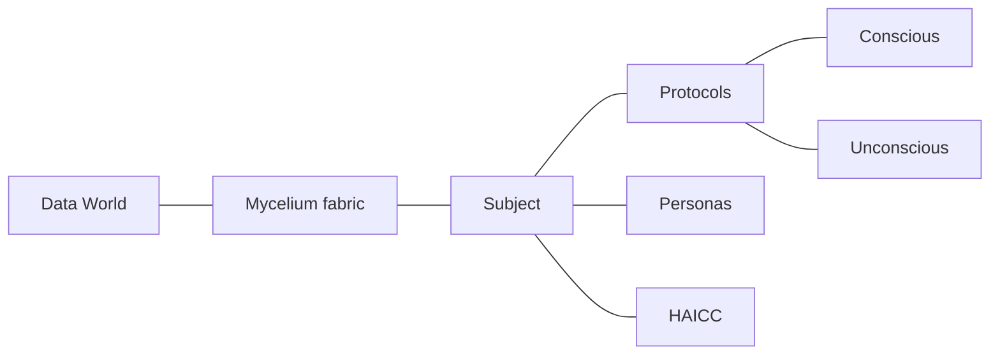

# Splectrum Engineering

In this post I am going to take a rather unusual step: Splectrum from first principles applied to engineering! It involves another round of the five seed principles, this time looking at them from an engineering point of view. Software engineering to be precise. The aim is to integrate the Splectrum philosophy as seamlessly as possible into AI enablement and engineering in general. The AI component is very important here, because it enables a fluidity of language which was not attainable before.

And if you wonder why principles for what is in essence a philosophical project would be good as a foundation for engineering: if Splectrum claims that its principles apply broadly across the field of human experience then that should include engineering.

## Post storyline

### 1. The premise

Philosophy drives engineering. The seed principles aren't a retrospective justification — they're the source. We took P1-P5 and asked: if these are true, what must exist? What fell out was a complete engineering architecture.

This is new ground. Software engineering has been trapped in its own vocabulary — classes, objects, APIs. AI-collaborative engineering can now reach into philosophy and other disciplines, using natural language concepts as engineering tools. The conversation that produced this moved freely between Heidegger and repository structure, between phenomenology and protocols.

### 2. The derivation

Walk through P1-P5, each producing components:

- **P1** (language is relational) → language as interaction medium, entities as encapsulated units
- **P2** (language is the medium of experience) → subject (POV entity), persona (interaction role), protocols (language games), conscious/unconscious (purpose vs infrastructure), HAICC (human-AI dynamic)
- **P3** (language is where subjects share) → mycelium as the sharing fabric, visibility as sharing, non-local interaction
- **P4** (languages are inter-relational, equal standing) → no hierarchy, data-driven coordination, orchestration within not across
- **P5** (web of growing complexity) → persistence, growth through diversification, spawn

### 3. The concepts

What structural concepts did we use in the derivation?

- Encapsulation — entities as units of encapsulated complexity
- Interaction surface — persona as the exposed role, not the whole subject
- Protocols as language games — engineering expression of language
- Conscious/unconscious — purpose vs infrastructure within the same subject
- Data-driven coordination — between languages, not orchestration
- Visibility as sharing — data shared when visible, not when copied
- The interface IS the medium — the boundary between subject and world

### 4. The USP

Reduce Heidegger's "being in the world" to a concrete interface. The subject doesn't touch the data world directly. It only ever experiences it through the mycelium fabric. The medium is the reality. You know the subject by its imprint on the fabric.

```
┌───────────────────────────────────┐
│                                   │
│            data world             │
│                                   │
│             ╭───────╮             │
│            ╱protocols╲            │
│           │  subject  │ ← mycelium│
│            ╲ HAICC  ╱             │
│             ╰───────╯             │
│                                   │
└───────────────────────────────────┘
```

### 5. What's next

Two conversations need to happen: HAICC — how the human-AI team works inside a subject. And Mycelium — the fabric that makes everything concrete. Invitation to spl5 to submit its thoughts.

### Tone notes

- Engineering post but with philosophical depth
- The cross-disciplinary method is the news — philosophy as engineering tool
- Concrete: show what fell out, link to the spec
- The diagrams carry the structure visually

---

## Diagrams (Mermaid — render to image on scheduling)

```mermaid-derivation
graph TD
    P1[P1: Language is relational] --> L[Language — interaction medium]
    P1 --> E[Entities — encapsulated units]

    P2[P2: Medium of experience] --> S[Subject — POV entity]
    P2 --> PE[Persona — interaction role]
    P2 --> PR[Protocols — language games]
    P2 --> CU[Conscious / Unconscious]
    P2 --> H[HAICC — human-AI dynamic]

    P3[P3: Sharing knowledge] --> M[Mycelium — sharing fabric]
    P3 --> V[Visibility as sharing]

    P4[P4: Inter-relational, equal] --> NH[No hierarchy]
    P4 --> DD[Data-driven coordination]

    P5[P5: Web of complexity] --> PER[Persistence]
    P5 --> SP[Spawn — growth through diversification]
```





---

## Tasks on scheduling

- [ ] Render diagrams to images
- [ ] Create reference page: docs/engineering/seed-spec/current.md
- [ ] Update vocabulary with new terms: entity, protocol, conversation, thought, conscious/unconscious, spawn
- [ ] Update docs index
- [ ] Link to full spec from post

---

## Raw notes — the full submission

(filtered from submissions/seed-spec-notes.md)

### Items extracted from P1-P5

1. **Data world** — the totality of data.
2. **Mycelium** — the fabric of reality as experienced by the subject. Creates the interface between the data world and the protocols.
3. **Subject** — entity with POV, a git-backed repo. Never touches data directly — only knows the interface.
4. **Entity** — encapsulated unit of historicity. It carries its history — it IS its history.
5. **Persona** — interaction role of a subject. One persona, many protocols.
6. **Protocol** — a language game. The engineering expression of language.
7. **Conversation** — the interaction pattern between entities through protocols.
8. **Thought** — a packet of data/information. Can be conscious or unconscious.
9. **HAICC** — subject-internal dynamic. Division of labour between human and AIs.
10. **Conscious/unconscious** — purpose protocols vs infrastructure protocols.
11. **Spawn** — growth through diversification.

### Subject internals

Three layers: conscious protocols (purpose), unconscious protocols (infrastructure), HAICC (cross-cutting dynamic — the division of labour between human and AIs).

Pilot and copilot: human and AI form the team that IS the subject. Who drives depends on the activity — meaning work: human drives; implementation: AI drives.

### Persona: one role, many protocols

A persona uses many protocols in service of its role. The persona is the why; the protocols are the how.

### Mycelium as engineering cornerstone

Splectrum is the heart. Mycelium is the engineering expression. All languages that make up the subject are projected onto the mycelium interface, embedded in metadata. You don't look inside the subject to know it — you read the interface.

### Seed spec vs Splectrum spec

Seed spec: what exists (this analysis). Splectrum spec: how everything must behave (not yet). The answer probably lives in mycelium — it IS the common grammar.

### Engineering as conversation

Protocols are conversations, not rigid API calls. Natural language at the interaction level, rigid implementation underneath. Mycelium's three layers: logical (conversation), capability (binding), physical (implementation). Protocol design starts from: what does the subject want to say?

---

## Reference page — docs/engineering/seed-spec/current.md

# Splectrum Seed Spec

Engineering derivation from the seed principles (P1-P5). What must exist if the principles are true.

Introduced in [Engineering from First Principles](https://julestenbos.blogspot.com/2026/05/engineering-from-first-principles.html).

## What P1-P5 produce

**P1 — Language is relational:**
- Language — the interaction medium between entities
- Entities — encapsulated units of complexity that participate in interactions

**P2 — Language is the medium through which a subject experiences reality:**
- Subject — the point-of-view entity, embedded in the information world by mycelium. Subject and world are inseparable.
- Persona — interaction roles of the subject. One persona, many protocols.
- Protocols — language games. The engineering expression of language.
- Conscious protocols — the functional purpose. What the subject is for.
- Unconscious protocols — supporting infrastructure. Not specific to purpose.
- HAICC — subject-internal dynamic. The division of labour between human and AIs, embedded in protocol implementations. Not a layer — a cross-cutting concern.

**P3 — Language is where subjects share knowledge about reality:**
- Mycelium — the sharing fabric. Creates the interface between the data world and subjects.
- Non-local interaction — sharing happens in the fabric, not between entities directly.
- Visibility as sharing — data is shared when actively visible from multiple subject contexts. Not copying, not sending.

**P4 — Languages are inter-relational with equal standing in potential:**
- No hierarchy — dependency without control. Bottom-up.
- Equal standing — every protocol, subject, persona has autonomy in its own domain.
- Data-driven coordination — between languages. Local rules, not central control.
- Orchestration within, not across — a language can orchestrate within its own game. It cannot orchestrate another language.

**P5 — Together they form a web of growing complexity:**
- Persistence — what's built stays. History accumulates.
- Web, not tree — relational structure throughout.
- Spawn — growth through diversification. New subjects, new protocols, new personas.

## Components

| Component | What it is |
|-----------|-----------|
| **Data world** | The totality of data |
| **Mycelium** | The fabric — interface between data world and subjects |
| **Subject** | Entity with POV, never touches data directly |
| **Entity** | Encapsulated unit of memory — in language, a concept (word) |
| **Persona** | Interaction role of a subject. One persona, many protocols |
| **Protocol** | A language game. Engineering expression of language |
| **Conversation** | Interaction pattern between entities through protocols |
| **Thought** | A packet of data/information. Conscious or unconscious |
| **HAICC** | Subject-internal: human-AI division of labour |
| **Conscious/Unconscious** | Purpose protocols vs infrastructure protocols |
| **Spawn** | Growth through diversification |

## Subject internals

Inside a subject, three layers:
1. **Conscious protocols** — the functional purpose. What the repo is for.
2. **Unconscious protocols** — supporting infrastructure. Git, test, tidy, protocol resolution.
3. **HAICC** — the dynamic woven across both. Division of labour between human and AIs. Not a layer — a cross-cutting concern.

Pilot and copilot: human and AI form the team that IS the subject. Who drives depends on the activity.

## Mycelium as engineering cornerstone

The subject never touches the data world directly. It only knows the interface mycelium constructs. All languages that make up the subject are projected onto the mycelium interface, embedded in metadata. You don't look inside the subject to know it — you read the interface.

```
┌───────────────────────────────────┐
│                                   │
│            data world             │
│                                   │
│             ╭───────╮             │
│            ╱protocols╲            │
│           │  subject  │ ← mycelium│
│            ╲ HAICC  ╱             │
│             ╰───────╯             │
│                                   │
└───────────────────────────────────┘
```

The square is the data world. The circle is the subject. The line of the circle is mycelium — the interface between inside and outside.

## Seed spec vs Splectrum spec

The seed spec (this document) says *what exists* — derived from P1-P5.

The Splectrum spec (not yet) will say *how everything must behave* — the shared grammar. The answer likely lives in mycelium: it IS the common grammar.

*(This page grows as the engineering develops.)*

---

## Vocabulary additions — append to docs/vocabulary.md

**Entity** — a unit of encapsulated data. In linguistics, maps to a signifier/signified unit.

**Protocol** — a language game as an engineering artefact. The engineering expression of language. Natural language at the interaction level, rigid implementation underneath.

**Conversation** — the interaction pattern between entities through protocols.

**Thought** — a packet of data or information. Can be conscious or unconscious. Often maps to a document or resource.

**Conscious protocols** — the functional purpose protocols of a subject. What the subject is for. Specific to this subject.

**Unconscious protocols** — supporting infrastructure protocols within a subject. Not specific to the purpose but specific to the internal nature of subjects generally.

**HAICC** — Human-AI Collaborative Creation. The subject-internal dynamic — the division of labour between human and AIs, embedded in protocol implementations. Not a layer — a cross-cutting concern. Pilot and copilot.

**Spawn** — growth through diversification. New subjects, new protocols, new personas. A consequence of P5. New carries its history.

**Mycelium** — the fabric that creates the interface between subjects and the data world. Makes the subject's existence concrete in the information world. The medium between being and the world. The engineering cornerstone.

**Data world** — the totality of data. The subject never touches it directly — only through the mycelium interface.
