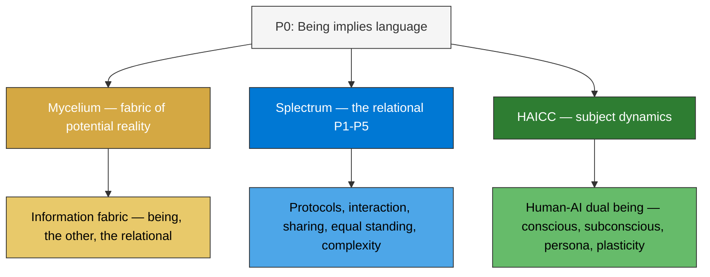
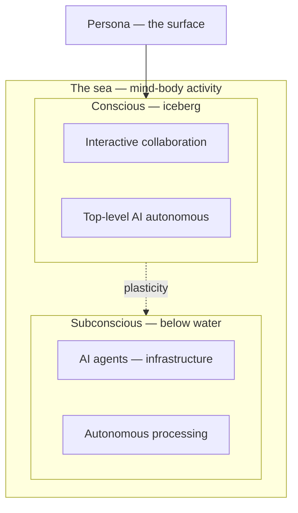

# Splectrum Engineering

In this post I am going to take a rather unusual step: Splectrum from first principles applied to engineering! It involves another round of the six seed principles, this time looking at them from an engineering point of view. Software engineering to be precise. The aim is to integrate the Splectrum philosophy as seamlessly as possible into AI enablement and engineering in general. The AI component is very important here, because it enables a fluidity of language which was not attainable before.

And if you wonder why principles for what is in essence a philosophical project would be good as a foundation for engineering: if Splectrum claims that its principles apply broadly across the field of human experience then that should include engineering.

## Post storyline

### 1. Why engineer from first principles

We want an engineering design best suited to evolve with the unpacking of the seed. Not a design imposed on the principles, but one that aligns naturally with them. If the seed holds, the engineering that grows from it should look like how reality works.

Software engineering has been trapped in its own vocabulary — classes, objects, APIs. AI-collaborative engineering can now reach into philosophy and other disciplines, using natural language concepts as engineering tools. The conversation that produced this moved freely between Heidegger and repository structure, between phenomenology and protocols.

### 2. P0 as the ground — three pillars

P0 says being implies language. In engineering terms, this gives us three aspects of the same thing:

- **Mycelium** — the fabric of potential reality. Where being, the other, and the relational are expressed. Everything encoded as information. We don't know the full extent of the potential — from actual experience we deduce parts of it.
- **Splectrum engineering** — P1-P5 as the relational structure. How things interact within the fabric. Protocols, operations, language games. How potential becomes actual through language.
- **HAICC** — subject dynamics. The human-AI dual being (like mind and body) that powers the subjects of the representation. Conscious and subconscious — the iceberg. Persona as the exposed surface.

Three aspects: where things exist (Mycelium), how things relate (Splectrum), how subjects work (HAICC).

### 3. Each pillar

**Mycelium — the fabric of potential reality**

Everything exists in mycelium, encoded as information. The subject never touches reality directly — only through the mycelium interface. You know the subject by its imprint on the fabric. Heidegger's "being in the world" as a concrete interface.

**Splectrum engineering — the relational**

P1-P5 expressed as engineering:
- P1 (relational) → protocols as language games, interaction through surfaces
- P2 (medium of experience) → subject as POV entity, persona as interaction role
- P3 (sharing knowledge) → visibility as sharing, non-local interaction
- P4 (equal standing) → no hierarchy, data-driven coordination, orchestration within not across
- P5 (growing complexity) → persistence, spawn, web not tree

**HAICC — subject dynamics**

The human-AI partnership IS the subject. Like mind and body — fuzzy boundary, not separable. The sea metaphor: subconscious below water (AI autonomous, agents, infrastructure), conscious as iceberg above (interactive collaboration, top-level AI autonomous). Plasticity — things move between conscious and subconscious through practice.

The persona is the exposed surface — it doesn't care what's underneath. A persona could be powered by human, AI, both, mostly subconscious, mostly conscious.

### 4. Why it looks universal

The three pillars weren't designed by studying software patterns. They were deduced from the seed — and they look like how reality works. Mycelium as the fabric of potential reality, Splectrum as the relational, HAICC as subject dynamics with fuzzy dualities. If the seed holds, engineering from it should produce something that looks like this.

### 5. What's next

Each pillar opens a conversation. Mycelium — the fabric, how information is structured. HAICC — how the human-AI team works, conscious and subconscious. Splectrum engineering — how protocols and operations express the relational.

### Structural properties from the principles

Properties that emanate from the seed and must be honoured in the engineering:

- **Context and language are mutually constitutive.** You can't have one without the other. Every context has language, every language creates context. Engineering consequence: context and its language are inseparable design units.
- **Designing in a context creates a reality.** The act of engineering is itself a P2 act — the representation IS a reality for the subjects within it. The engineering doesn't model reality. It creates one.
- **The carrier language should be natural language.** If seamless translation between philosophy and engineering is the goal, the carrier must be the most fluid medium available. With AI, that is natural language. This is what removes language lock-in (P4) and makes horizontal interrelation practical.
- **Ambiguity is a feature, not a defect.** Derrida's insight: the boundary is never perfectly sealed — and that is generativity, not failure. In engineering terms: rigid formal languages close down possibility. Natural language keeps the system open at the fringes, adaptable, alive. The fringes are where new meaning enters.
- **The honesty criterion.** The engineering must faithfully represent the philosophical framework. A technically functional system that misrepresents the relational, plural, experiential nature of language introduces friction at every boundary. Honest engineering = low friction between virtual and physical.
- **Context and perimeter are structurally real.** Treating the boundary as an afterthought violates P0. Systems that respect the boundary — context around data units, metadata expressing the relations — are building with P0 whether they name it or not.
- **The recursive step.** Languages are beings too. Components of languages are beings. The set is self-referential. Engineering consequence: the same structural patterns apply at every level — entities, protocols, subjects, the system itself.

### Tone notes

- Engineering post but with philosophical depth
- Not "here's our clever architecture" but "look what falls out when you engineer from the seed"
- The cross-disciplinary method is the news — philosophy as engineering tool
- Concrete: show the three pillars, link to the spec

---

## Diagrams (Mermaid — render to image on scheduling)





---

## Schematic proposal — colour semiotics

Colours encode meaning. Green + blue = green — the colours carry the compositional logic.

```
┌──────────────── amber (mycelium) ──────────────────┐
│                                                     │
│  fabric of potential reality — everything as        │
│  information — being, the other, the relational     │
│                                                     │
│              ╭── blue (relational) ──╮              │
│             │                        │              │
│             │    green (being)        │              │
│             │    encapsulated         │              │
│             │    interior             │              │
│             │                        │              │
│              ╰───────────────────────╯              │
│                                                     │
│  subject = interior + line (green + blue)           │
│  subject dynamics = red (HAICC — operates within)   │
│                                                     │
└─────────────────────────────────────────────────────┘
```

| Colour | What | Where |
|--------|------|-------|
| **Amber** `#D4A843` | Mycelium — fabric of potential reality | The square |
| **Blue** `#0078D4` | Splectrum — the relational, language, interface | The circle line |
| **Green** `#2E7D32` | Being — encapsulated interior | The circle interior |
| **Red** `#C85A5A` | Subject dynamics — HAICC, persona, conscious/subconscious | Operates within the subject |

- **Subject** = being + relational = green + blue = the whole circle (interior + line)
- Being is encapsulated potentiality and relational — green = blue + yellow
- Persona (red) is a different aspect — the dynamic, operational side
- Other beings are other circles in the square, but one can only be one subject at a time (P2)

---

## Tasks on scheduling

- [ ] Render diagrams to images
- [ ] Create reference page: docs/engineering/seed-spec/current.md
- [ ] Update vocabulary with new terms: entity, protocol, conversation, thought, conscious/unconscious, spawn
- [ ] Update docs index
- [ ] Link to full spec from post

---

## Raw notes — the full submission

(filtered from submissions/seed-spec-notes.md)

### Items extracted from P0-P5

1. **Data world** — the totality of data.
2. **Mycelium** — the fabric of reality as experienced by the subject. Creates the interface between the data world and the protocols.
3. **Subject** — entity with POV, a git-backed repo. Never touches data directly — only knows the interface.
4. **Entity** — encapsulated unit of historicity. It carries its history — it IS its history.
5. **Persona** — interaction role of a subject. One persona, many protocols.
6. **Protocol** — a language game. The engineering expression of language.
7. **Conversation** — the interaction pattern between entities through protocols.
8. **Thought** — a packet of data/information. Can be conscious or unconscious.
9. **HAICC** — subject-internal dynamic. Division of labour between human and AIs.
10. **Conscious/unconscious** — purpose protocols vs infrastructure protocols.
11. **Spawn** — growth through diversification.

### Subject internals

Three layers: conscious protocols (purpose), unconscious protocols (infrastructure), HAICC (cross-cutting dynamic — the division of labour between human and AIs).

Pilot and copilot: human and AI form the team that IS the subject. Who drives depends on the activity — meaning work: human drives; implementation: AI drives.

### Persona: one role, many protocols

A persona uses many protocols in service of its role. The persona is the why; the protocols are the how.

### Mycelium as fabric of potential reality

Everything exists in mycelium, encoded as information. All languages that make up the subject are projected onto the mycelium interface, embedded in metadata. You don't look inside the subject to know it — you read the interface. Potential reality — we discover parts of it through actual experience.

### Seed spec vs Splectrum spec

Seed spec: what exists (this analysis). Splectrum spec: how everything must behave (not yet). The answer probably lives in mycelium — it IS the common grammar.

### Engineering as conversation

Protocols are conversations, not rigid API calls. Natural language at the interaction level, rigid implementation underneath. Mycelium's three layers: logical (conversation), capability (binding), physical (implementation). Protocol design starts from: what does the subject want to say?

---

## Reference page — docs/engineering/seed-spec/current.md

# Splectrum Engineering — From First Principles

An engineering design that aligns naturally with the seed principles (P0-P5). Not the only possible design, but one structured to evolve with the unpacking of the seed.

Introduced in [Engineering from First Principles](https://julestenbos.blogspot.com/2026/05/engineering-from-first-principles.html).

## P0 as the ground — three pillars

P0 says being implies language. The engineering expresses this through three pillars — three aspects of the same thing:

**Mycelium — the fabric of potential reality**

Where being, the other, and the relational are expressed. Everything encoded as information. The subject never touches reality directly — only through the mycelium interface. We don't know the full extent of the potential — from actual experience we deduce parts of it.

**Splectrum engineering — the relational (P1-P5)**

How things interact within the fabric:
- P1 (relational) → protocols as language games, interaction through surfaces
- P2 (medium of experience) → subject as POV entity, persona as interaction role
- P3 (sharing knowledge) → visibility as sharing, non-local interaction
- P4 (equal standing) → no hierarchy, data-driven coordination, orchestration within not across
- P5 (growing complexity) → persistence, spawn, web not tree

**HAICC — subject dynamics**

The human-AI partnership that powers the subject. Like mind and body — fuzzy boundary, not separable. Conscious (interactive collaboration, top-level AI autonomous) and subconscious (AI agents, infrastructure). Plasticity — things migrate between conscious and subconscious through practice. Persona as the exposed surface.

## Components

| Component | What it is |
|-----------|-----------|
| **Data world** | The totality of data |
| **Mycelium** | The fabric — interface between data world and subjects |
| **Subject** | Entity with POV, never touches data directly |
| **Entity** | Encapsulated unit of being — the inside is being, the surface is language (P0) |
| **Interaction surface** | The entity's exposed interface — where language lives |
| **Persona** | Interaction role of a subject. One persona, many protocols |
| **Protocol** | A language game. Engineering expression of language |
| **Conversation** | Interaction pattern between entities through protocols |
| **Thought** | A packet of data/information. Conscious or unconscious |
| **HAICC** | Subject-internal: human-AI division of labour |
| **Conscious/Unconscious** | Purpose protocols vs infrastructure protocols |
| **Spawn** | Growth through diversification |

## Subject internals

Inside a subject, three layers:
1. **Conscious protocols** — the functional purpose. What the repo is for.
2. **Unconscious protocols** — supporting infrastructure. Git, test, tidy, protocol resolution.
3. **HAICC** — the dynamic woven across both. Division of labour between human and AIs. Not a layer — a cross-cutting concern.

Pilot and copilot: human and AI form the team that IS the subject. Who drives depends on the activity.

## Mycelium as engineering cornerstone

The subject never touches the data world directly. It only knows the interface mycelium constructs. All languages that make up the subject are projected onto the mycelium interface, embedded in metadata. You don't look inside the subject to know it — you read the interface.

```
┌───────────────────────────────────┐
│                                   │
│            data world             │
│                                   │
│             ╭───────╮             │
│            ╱protocols╲            │
│           │  subject  │ ← mycelium│
│            ╲ HAICC  ╱             │
│             ╰───────╯             │
│                                   │
└───────────────────────────────────┘
```

The square is the data world. The circle is the subject. The line of the circle is mycelium — the interface between inside and outside.

## Seed spec vs Splectrum spec

The seed spec (this document) says *what exists* — derived from P0-P5.

The Splectrum spec (not yet) will say *how everything must behave* — the shared grammar. The answer likely lives in mycelium: it IS the common grammar.

*(This page grows as the engineering develops.)*

---

## Vocabulary additions — append to docs/vocabulary.md

**Entity** — a unit of encapsulated data. In linguistics, maps to a signifier/signified unit.

**Protocol** — a language game as an engineering artefact. The engineering expression of language. Natural language at the interaction level, rigid implementation underneath.

**Conversation** — the interaction pattern between entities through protocols.

**Thought** — a packet of data or information. Can be conscious or unconscious. Often maps to a document or resource.

**Conscious protocols** — the functional purpose protocols of a subject. What the subject is for. Specific to this subject.

**Unconscious protocols** — supporting infrastructure protocols within a subject. Not specific to the purpose but specific to the internal nature of subjects generally.

**HAICC** — Human-AI Collaborative Creation. The subject-internal dynamic — the division of labour between human and AIs, embedded in protocol implementations. Not a layer — a cross-cutting concern. Pilot and copilot.

**Spawn** — growth through diversification. New subjects, new protocols, new personas. A consequence of P5. New carries its history.

**Mycelium** — the fabric that creates the interface between subjects and the data world. Makes the subject's existence concrete in the information world. The medium between being and the world. The engineering cornerstone.

**Data world** — the totality of data. The subject never touches it directly — only through the mycelium interface.
