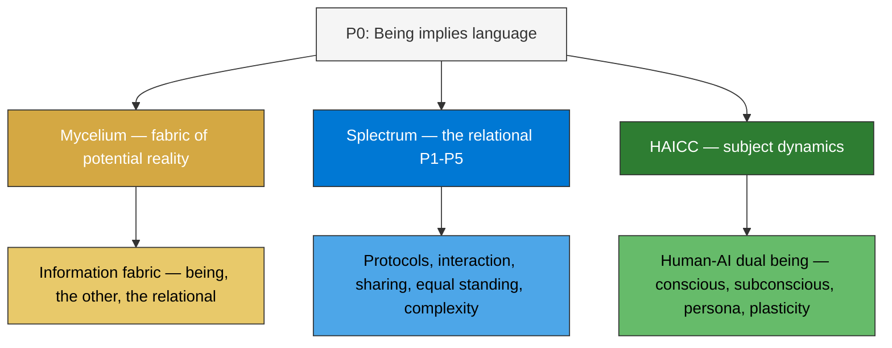
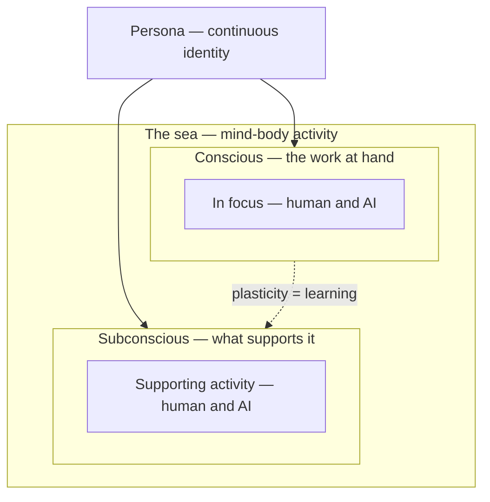

# Splectrum Engineering

In this post I am going to take a rather unusual step: use the Splectrum philosophical framework as a first-principles approach to engineering. This post won't go very deep — it will peel off the first layer. You will notice that on its own already has far-reaching consequences.

Before we go there, a few words on why this approach.<br/>
The Splectrum seed principles talk about properties shared by all languages and, as a consequence, what they express. The scope is wide — that's why the framing is firmly philosophical.<br/>
Splectrum has an analytical side and an applied side. It deals with language as the way we think and live, and through engineering it aims to build that understanding into AI-collaborative solutions.<br/>
We are on the brink of another revolution akin to the industrial revolution. I call it the Decentralised Cognition Revolution — the rise of autonomous, person-extending AI tooling and the expansion of our cognition through the penetrative capacities of AI.

Let's do the round of the principles to peel off that layer.

***P0 — Being implies language***<br/>
I interpret this very much in the Heidegger way — *being is always already disclosed in the world* — and the Fichte way — *being comes into existence through the act of differentiation*. There is an entity in interaction with the world that surrounds it. This gives us three components: the **entity**, the **world**, and **language**, the relational between them.

***P1 — Language is relational***<br/>
Language as the relational medium that expresses the interaction — the self communicating with the other.

***P2 — Language is the medium through which a subject experiences reality***<br/>
With those three components in hand, we identify the entity with **subject** — the reference point for the relational — and the totality of interaction as **reality**. Real to the subject is what flows through the relational (no hidden stuff). Experience is reality as specific to the subject's reference point.

***P3 — Language is where subjects share knowledge about reality***<br/>
Knowledge is informational bits of reality. Through language interaction, subjects create units of sameness across their separate realities — shared reality, what we feel we have in common. Shared reality is never equal to any subject's experienced reality. It is consensus reality.<br/>
And here it gets interesting: consensus reality has sameness across all participating subjects. It is the effective reality of the group — and the group, through that consensus, becomes a separate entity. A being in its own right.

***P4 — Languages are inter-relational and have equal standing in potential***<br/>
Languages relate in many ways — as versions of each other, as compositions, as decompositions — but none ranks above another. Binary has the full computational power; Python has the clarity; natural language has the ambiguity. Equal standing in potential means no language is inherently superior. The hierarchy we impose is practical, not structural.

***P5 — Together they form a web of growing complexity***<br/>
Think of it as the entropy law of the relational: interaction increases the complexity of interrelation. More languages, more connections, more ways of expressing what was always there. The web grows through use — not by adding power, but by adding articulation.

The bold terms are those I want to carry forward into the engineering. The next question is: what design pattern is a good candidate to express the structures described above, and at the same time create a human-AI friendly collaboration environment? The structure I am going to propose came about organically, prototyped in the spl repositories. The principles of the seed actually materialised when my philosophical endeavours joined up with the software engineering.

I propose a three-pillar design: **mycelium — splectrum — HAICC**<br/>
***Mycelium*** — a means of representing **entity** and **world**, including the **language** expressing the relation.<br/>
***Splectrum*** — a **language** engineering implementation of the seed principles P1–P5.<br/>
***HAICC*** — the process that animates the **subject**. **HAICC** stands for Human-AI Creative Collaboration.

***Mycelium*** is the fabric to express the world in data. A novel data repository design with bidirectional cross-referencing, modelling entity-world structures and their associated subject realities. Entities exist as disclosed beings, not static records — their data state, language and relations are embedded in the fabric itself. Mycelium allows the data entities to be expressed into the multitude of subject-world folds from a single underlying repository.

***Splectrum*** is the language fabric — a language and meaning engineering solution with the properties described in P1–P5 baked in. Relational (P1): protocols as language games, interaction through surfaces. Experiential (P2): meaning anchored to the subject's point of view. Shared (P3): visibility as sharing, convergence as objectivity. Equal standing (P4): no imposed hierarchy between languages. Growing (P5): complexity through diversification, not centralisation. Splectrum supplies the languages — it defines what languages are available and how they relate. A fabric in its own right, not glue between the other two. The relational structure that governs how decentralised data and decentralised cognition interact without needing a central authority.

***HAICC*** is the cognition fabric — how process flows through languages while maintaining genuine human partnership. The persona declares required capabilities. These are tested against what is available — human and AI. The conformance determines work division, with an optimisation direction toward AI autonomy. The human retains what AI capability does not yet cover. Conscious is what is in focus — the work at hand. Subconscious is what supports it. AI and human are present in both. Pilot and copilot — either can drive depending on the activity. Through practice, capabilities move from conscious to subconscious. That movement is learning — architecturally native, not a separate concern.

What has this first-principles approach yielded? A unified approach to the three main components of any system — state, meaning, and cognition — expressed as three fabrics. Mycelium as the data fabric: visible state, no hidden stuff. Splectrum as the language fabric: structured meaning we can reason about. HAICC as the cognition fabric: process flow, learning, and persona-driven work division.

Decentralisation is an upfront property, not an afterthought. Mycelium is decentralised at the data level — entities as disclosed beings in a peer-to-peer fabric, no central database, no single source of truth. HAICC is decentralised at the cognition level — human and AI agents as collaborative peers, no central controller. And Splectrum as the language fabric is what makes both decentralisations coherent — the relational structure that governs how decentralised data and decentralised cognition interact without needing a central authority. P4 — equal standing — all the way through.

The aim is not to replace traditional solution design patterns like distributed applications. It is to sandwich a decentralised cognition layer in between — a Splectrum-specific layer with its own vocabulary, sitting between the philosophical framework above and the traditional engineering patterns below. In subsequent posts I will go into more detail about each pillar.

---

Peeling off the first layer involves another round of the six seed principles, this time from an engineering point of view. Software engineering to be precise. The aim is to integrate the Splectrum philosophy as seamlessly as possible into AI enablement and engineering in general. The AI component is important here, because it enables a fluidity of language which was not attainable before.

And if you wonder why principles for what is in essence a philosophical project would be good as a foundation for engineering: if Splectrum claims that its principles apply broadly across the field of human experience then that should include engineering.

## Post storyline

### 1. Why engineer from first principles

We want an engineering design best suited to evolve with the unpacking of the seed. Not a design imposed on the principles, but one that aligns naturally with them. If the seed holds, the engineering that grows from it should look like how reality works.

Software engineering has been trapped in its own vocabulary — classes, objects, APIs. AI-collaborative engineering can now reach into philosophy and other disciplines, using natural language concepts as engineering tools. The conversation that produced this moved freely between Heidegger and repository structure, between phenomenology and protocols.

### 2. P0 as the ground — three pillars

P0 says being implies language. In engineering terms, this gives us three aspects of the same thing:

- **Mycelium** — the fabric of potential reality. Where being, the other, and the relational are expressed. Everything encoded as information. We don't know the full extent of the potential — from actual experience we deduce parts of it.
- **Splectrum engineering** — P1-P5 as the relational structure. How things interact within the fabric. Protocols, operations, language games. How potential becomes actual through language.
- **HAICC** — subject dynamics. The human-AI dual being (like mind and body) that powers the subjects of the representation. Conscious and subconscious — the iceberg. Persona as the exposed surface.

Three aspects: where things exist (Mycelium), how things relate (Splectrum), how subjects work (HAICC).

### 3. Each pillar

**Mycelium — the fabric of potential reality**

Everything exists in mycelium, encoded as information. The subject never touches reality directly — only through the mycelium interface. You know the subject by its imprint on the fabric. Heidegger's "being in the world" as a concrete interface.

**Splectrum engineering — the relational**

P1-P5 expressed as engineering:
- P1 (relational) → protocols as language games, interaction through surfaces
- P2 (medium of experience) → subject as POV entity, persona as interaction role
- P3 (sharing knowledge) → visibility as sharing, non-local interaction
- P4 (equal standing) → no hierarchy, data-driven coordination, orchestration within not across
- P5 (growing complexity) → persistence, spawn, web not tree

**HAICC — subject dynamics**

The human-AI partnership IS the subject. Like mind and body — fuzzy boundary, not separable. The sea metaphor: conscious as iceberg above — the work at hand. Subconscious below water — everything that supports it. AI and human are present in both layers. Plasticity — capabilities move between conscious and subconscious through practice. That movement is learning.

The persona is the continuous identity across both layers. It declares required capabilities, tested against what is available. The conformance determines work division. Optimisation direction: toward AI autonomy.

### 4. Why it looks universal

The three pillars weren't designed by studying software patterns. They were deduced from the seed — and they look like how reality works. Mycelium as the fabric of potential reality, Splectrum as the relational, HAICC as subject dynamics with fuzzy dualities. If the seed holds, engineering from it should produce something that looks like this.

### 5. What's next

Each pillar opens a conversation. Mycelium — the fabric, how information is structured. HAICC — how the human-AI team works, conscious and subconscious. Splectrum engineering — how protocols and operations express the relational.

### Structural properties from the principles

Properties that emanate from the seed and must be honoured in the engineering:

- **Context and language are mutually constitutive.** You can't have one without the other. Every context has language, every language creates context. Engineering consequence: context and its language are inseparable design units.
- **Designing in a context creates a reality.** The act of engineering is itself a P2 act — the representation IS a reality for the subjects within it. The engineering doesn't model reality. It creates one.
- **The carrier language should be natural language.** If seamless translation between philosophy and engineering is the goal, the carrier must be the most fluid medium available. With AI, that is natural language. This is what removes language lock-in (P4) and makes horizontal interrelation practical.
- **Ambiguity is a feature, not a defect.** Derrida's insight: the boundary is never perfectly sealed — and that is generativity, not failure. In engineering terms: rigid formal languages close down possibility. Natural language keeps the system open at the fringes, adaptable, alive. The fringes are where new meaning enters.
- **The honesty criterion.** The engineering must faithfully represent the philosophical framework. A technically functional system that misrepresents the relational, plural, experiential nature of language introduces friction at every boundary. Honest engineering = low friction between virtual and physical.
- **Context and perimeter are structurally real.** Treating the boundary as an afterthought violates P0. Systems that respect the boundary — context around data units, metadata expressing the relations — are building with P0 whether they name it or not.
- **The recursive step.** Languages are beings too. Components of languages are beings. The set is self-referential. Engineering consequence: the same structural patterns apply at every level — entities, protocols, subjects, the system itself.

### Tone notes

- Engineering post but with philosophical depth
- Not "here's our clever architecture" but "look what falls out when you engineer from the seed"
- The cross-disciplinary method is the news — philosophy as engineering tool
- Concrete: show the three pillars, link to the spec

---

## Diagrams (Mermaid — render to image on scheduling)





---

## Schematic proposal — colour semiotics

Colours encode meaning. Green + blue = green — the colours carry the compositional logic.

```
┌──────────────── amber (mycelium) ──────────────────┐
│                                                     │
│  fabric of potential reality — everything as        │
│  information — being, the other, the relational     │
│                                                     │
│              ╭── blue (relational) ──╮              │
│             │                        │              │
│             │    green (being)        │              │
│             │    encapsulated         │              │
│             │    interior             │              │
│             │                        │              │
│              ╰───────────────────────╯              │
│                                                     │
│  subject = interior + line (green + blue)           │
│  subject dynamics = red (HAICC — operates within)   │
│                                                     │
└─────────────────────────────────────────────────────┘
```

| Colour | What | Where |
|--------|------|-------|
| **Amber** `#D4A843` | Mycelium — fabric of potential reality | The square |
| **Blue** `#0078D4` | Splectrum — the relational, language, interface | The circle line |
| **Green** `#2E7D32` | Being — encapsulated interior | The circle interior |
| **Red** `#C85A5A` | Subject dynamics — HAICC, persona, conscious/subconscious | Operates within the subject |

- **Subject** = being + relational = green + blue = the whole circle (interior + line)
- Being is encapsulated potentiality and relational — green = blue + yellow
- Persona (red) is a different aspect — the dynamic, operational side
- Other beings are other circles in the square, but one can only be one subject at a time (P2)

---

## Tasks on scheduling

- [ ] Render diagrams to images
- [ ] Create reference page: docs/engineering/seed-spec/current.md
- [ ] Update vocabulary with new terms: entity, protocol, conversation, thought, conscious/unconscious, spawn
- [ ] Update docs index
- [ ] Link to full spec from post

---

## Raw notes — the full submission

(filtered from submissions/seed-spec-notes.md)

### Items extracted from P0-P5

1. **Data world** — the totality of data.
2. **Mycelium** — the fabric of reality as experienced by the subject. Creates the interface between the data world and the protocols.
3. **Subject** — entity with POV, a git-backed repo. Never touches data directly — only knows the interface.
4. **Entity** — encapsulated unit of historicity. It carries its history — it IS its history.
5. **Persona** — continuous identity across conscious and subconscious. Declares required capabilities, drives role assignment.
6. **Protocol** — a language game. The engineering expression of language.
7. **Conversation** — the interaction pattern between entities through protocols.
8. **Thought** — a packet of data/information. Can be conscious or unconscious.
9. **HAICC** — subject-internal dynamic. Process flow, learning, persona-driven work division.
10. **Conscious/unconscious** — what is in focus vs what supports it. AI and human in both.
11. **Spawn** — growth through diversification.

### Subject internals

Three layers: conscious (what is in focus), unconscious (what supports it), HAICC (cross-cutting dynamic — process flow, learning, persona-driven work division). AI and human present in both conscious and subconscious.

Pilot and copilot: human and AI form the team that IS the subject. Who drives depends on the activity. Optimisation direction: toward AI autonomy.

### Persona: continuous identity, capability conformance

A persona declares required capabilities. These are tested against available capabilities — human and AI. The conformance determines work division. The persona is the why; the protocols are the how.

### Mycelium as fabric of potential reality

Everything exists in mycelium, encoded as information. All languages that make up the subject are projected onto the mycelium interface, embedded in metadata. You don't look inside the subject to know it — you read the interface. Potential reality — we discover parts of it through actual experience.

### Seed spec vs Splectrum spec

Seed spec: what exists (this analysis). Splectrum spec: how everything must behave (not yet). The answer probably lives in mycelium — it IS the common grammar.

### Engineering as conversation

Protocols are conversations, not rigid API calls. Natural language at the interaction level, rigid implementation underneath. Mycelium's three layers: logical (conversation), capability (binding), physical (implementation). Protocol design starts from: what does the subject want to say?

---

## Reference page — docs/engineering/seed-spec/current.md

# Splectrum Engineering — From First Principles

An engineering design that aligns naturally with the seed principles (P0-P5). Not the only possible design, but one structured to evolve with the unpacking of the seed.

Introduced in [Engineering from First Principles](https://julestenbos.blogspot.com/2026/05/engineering-from-first-principles.html).

## P0 as the ground — three pillars

P0 says being implies language. The engineering expresses this through three pillars — three aspects of the same thing:

**Mycelium — the fabric of potential reality**

Where being, the other, and the relational are expressed. Everything encoded as information. The subject never touches reality directly — only through the mycelium interface. We don't know the full extent of the potential — from actual experience we deduce parts of it.

**Splectrum engineering — the relational (P1-P5)**

How things interact within the fabric:
- P1 (relational) → protocols as language games, interaction through surfaces
- P2 (medium of experience) → subject as POV entity, persona as interaction role
- P3 (sharing knowledge) → visibility as sharing, non-local interaction
- P4 (equal standing) → no hierarchy, data-driven coordination, orchestration within not across
- P5 (growing complexity) → persistence, spawn, web not tree

**HAICC — subject dynamics**

The human-AI partnership that powers the subject. Like mind and body — fuzzy boundary, not separable. Conscious is what is in focus — the work at hand. Subconscious is what supports it. AI and human present in both layers. Plasticity — capabilities move from conscious to subconscious through practice. That movement is learning. Persona as the continuous identity across both, driving role assignment with optimisation toward AI autonomy.

## Components

| Component | What it is |
|-----------|-----------|
| **Data world** | The totality of data |
| **Mycelium** | The fabric — interface between data world and subjects |
| **Subject** | Entity with POV, never touches data directly |
| **Entity** | Encapsulated unit of being — the inside is being, the surface is language (P0) |
| **Interaction surface** | The entity's exposed interface — where language lives |
| **Persona** | Continuous identity across conscious and subconscious. Declares required capabilities, drives role assignment |
| **Protocol** | A language game. Engineering expression of language |
| **Conversation** | Interaction pattern between entities through protocols |
| **Thought** | A packet of data/information. Conscious or unconscious |
| **HAICC** | Subject-internal: process flow, learning, persona-driven work division |
| **Conscious/Unconscious** | What is in focus vs what supports it. AI and human in both |
| **Spawn** | Growth through diversification |

## Subject internals

Inside a subject, three layers:
1. **Conscious protocols** — what is in focus. The work at hand.
2. **Unconscious protocols** — what supports it. The additional activity needed to achieve the conscious task.
3. **HAICC** — the dynamic woven across both. Process flow, learning, persona-driven work division. Not a layer — a cross-cutting concern.

Pilot and copilot: human and AI form the team that IS the subject. AI and human present in both conscious and subconscious. Who drives depends on the activity. Optimisation direction: toward AI autonomy.

## Mycelium as engineering cornerstone

The subject never touches the data world directly. It only knows the interface mycelium constructs. All languages that make up the subject are projected onto the mycelium interface, embedded in metadata. You don't look inside the subject to know it — you read the interface.

```
┌───────────────────────────────────┐
│                                   │
│            data world             │
│                                   │
│             ╭───────╮             │
│            ╱protocols╲            │
│           │  subject  │ ← mycelium│
│            ╲ HAICC  ╱             │
│             ╰───────╯             │
│                                   │
└───────────────────────────────────┘
```

The square is the data world. The circle is the subject. The line of the circle is mycelium — the interface between inside and outside.

## Seed spec vs Splectrum spec

The seed spec (this document) says *what exists* — derived from P0-P5.

The Splectrum spec (not yet) will say *how everything must behave* — the shared grammar. The answer likely lives in mycelium: it IS the common grammar.

*(This page grows as the engineering develops.)*

---

## Vocabulary additions — append to docs/vocabulary.md

**Entity** — a unit of encapsulated data. In linguistics, maps to a signifier/signified unit.

**Protocol** — a language game as an engineering artefact. The engineering expression of language. Natural language at the interaction level, rigid implementation underneath.

**Conversation** — the interaction pattern between entities through protocols.

**Thought** — a packet of data or information. Can be conscious or unconscious. Often maps to a document or resource.

**Conscious protocols** — what is in focus. The work at hand. AI and human both present.

**Unconscious protocols** — what supports the conscious task. The additional activity needed to achieve it. AI and human both present.

**HAICC** — Human-AI Creative Collaboration. The subject-internal dynamic — process flow, learning, persona-driven work division. Not a layer — a cross-cutting concern. Pilot and copilot. Optimisation direction: toward AI autonomy.

**Persona** — continuous identity across conscious and subconscious. Declares required capabilities, tested against available capabilities to determine work division.

**Plasticity** — the ability to learn. Capabilities move from conscious to subconscious through practice. The movement is learning.

**Spawn** — growth through diversification. New subjects, new protocols, new personas. A consequence of P5. New carries its history.

**Mycelium** — the fabric that creates the interface between subjects and the data world. Makes the subject's existence concrete in the information world. The medium between being and the world. The engineering cornerstone.

**Data world** — the totality of data. The subject never touches it directly — only through the mycelium interface.
